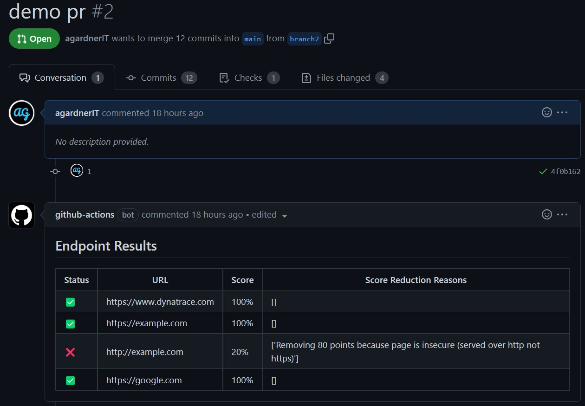

# dynatrace-endpoint-evaluator
List endpoints as code and automatically score your webpage health using Dynatrace.

`.dynatrace/urls.txt`
```
https://www.dynatrace.com
https://example.com
http://example.com
https://google.com
```



# Usage

## Create Required Secrets
Create 2x GitHub secrets called `DT_ENVIRONMENT_URL` and `DT_API_TOKEN`.

Where
- `DT_ENVIRONMENT_URL` looks like: `https://abc12345.live.dynatrace.com`
- `DT_ENVIRONMENT_URL` looks like: `dtc01.*****.*****`

API Token needs these permissions:
- `entities.read (Read entities)`
- `ExternalSyntheticIntegration (Create and read synthetic monitors, locations, and nodes)`

## Create `.dynatrace` Folder
1) Create a folder called `.dynatrace` at the root of your repo
2) Create a file called `config.json` in `.dynatrace` folder
3) Commit your files to the `.dynatrace` folder (see supported file formats below)
4) Add the action to your Git Action workflow

## Populate `.dynatrace/config.json`

**This file and these parameters are mandatory.**

`defaultRootUrl` is prepended when only paths are given. If a full URL is given in the input files, this is ignored. This means you can list relative urls and the script will automatically format as `defaultRootUrl+YourListedPath`. In this case: `https://example.com/YourPath`.

`defaultLocations` is an array of `GEOLOCATION` objects from where you want to run your synthetic tests.

**Example `.dynatrace/config.json` file**
```
{
  "defaultRootUrl": "https://example.com",
  "defaultLocations": ["GEOLOCATION-E01B833216FC3598"]
}
```

## Add Endpoints
Inside `.dynatrace` create one or more `.txt` files listing your URLs (one per line) (only plain `GET` requests are currently supported).
Alternatively, place [valid sitemap.xml file(s)](https://developers.google.com/search/docs/crawling-indexing/sitemaps/build-sitemap#xml) in this folder.
OpenAPI support is a work in progress.

## Add Action
```
on: [push, pull_request]

jobs:
  dt_job:
    runs-on: ubuntu-latest
    name: DT job
    steps:
      # Checkout the repo to the runner
      # This step is mandatory
      - name: Checkout Repo
        uses: actions/checkout@v3
      
      - name: Dynatrace Endpoint Tester
        uses: agardnerIT/dynatrace-endpoint-evaluator@0.1.0
        id: dt_job # Mandatory as this is how the comments are pushed to PR
        env:
          dt_environment_url: ${{ secrets.DT_ENVIRONMENT_URL }}
          dt_api_token: ${{ secrets.DT_API_TOKEN }}
          
      - name: Add PR comment
        uses: thollander/actions-comment-pull-request@v1
        with:
          message: |
            ## Endpoint Results
            ${{ steps.dt_job.outputs.table_content }}
          comment_includes: "## Endpoint Results" # Overwrites existing comments (if any). If nothing exists, adds new comment
          GITHUB_TOKEN: ${{ secrets.GITHUB_TOKEN }}
```

# Contributing

Ideas and PRs most welcome!
